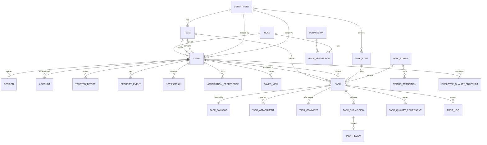

# 03 · Database

PostgreSQL on Neon, accessed through Drizzle with `casing: "snake_case"` — TypeScript stays camelCase, SQL stays snake_case, and neither side has to compromise.

**Status: session 2's tables are designed and migrated; the rest are designed only.** Tables land one vertical slice at a time, and this file is updated in the session that creates them. Each table below carries the session that introduces it.

Session 2 created eight: `user`, `session`, `account`, `verification`, `two_factor`, `trusted_device`, `login_attempt`, `password_history` — migration `drizzle/0000_calm_johnny_storm.sql`, schema in `src/db/schema/auth.ts`.

Two conventions below are **not** what session 2 actually shipped, and the difference is deliberate:

- **Primary keys are `text`, not `uuid`.** Better Auth generates its own ids and stores them as strings; it owns five of these eight tables, so the project's three follow the same type rather than splitting the schema in two.
- **`user.role` is a `text` key, not `role_id`.** The role tables arrive in session 3. Until then the column carries one of `ROLE_KEYS` from `src/lib/permissions.ts` and session 3 migrates it to a reference — the roadmap's own boundary for session 2.

## Conventions

- Primary keys are `uuid` with `gen_random_uuid()`, except where an external identity already exists.
- Every table has `created_at timestamptz not null default now()`. Mutable tables also have `updated_at`.
- Deletion is soft wherever history matters (`deleted_at timestamptz`), because the audit log must keep pointing at something real.
- **Every foreign key is indexed**, and so is every column a list filters or sorts on. The index list per table below is not aspirational; it is part of the migration.
- Money and scores are `numeric`, never float. Scores are `numeric(5,2)` on a 0–100 scale.
- Enumerated values that an admin can edit at runtime (statuses, task types, departments, roles) are **tables**, not PostgreSQL enums. Values genuinely fixed in code (priority, task-type department kind) are `text` with a check constraint.

## ERD

## Tables

### Organisation

#### `department` — session 4

| Column       | Type                          | Notes                                                                          |
| ------------ | ----------------------------- | ------------------------------------------------------------------------------ |
| `id`         | uuid pk                       |                                                                                |
| `name`       | text not null                 | `البرمجة`                                                                      |
| `key`        | text not null unique          | `programming` — the machine identifier the admin sets                          |
| `kind`       | text not null                 | check in (`delivery`, `source`, `both`) — receives work, creates work, or both |
| `color`      | text not null                 | token name: `blue`, `violet`, `green`, `amber`                                 |
| `head_id`    | uuid → user.id null           |                                                                                |
| `is_active`  | boolean not null default true |                                                                                |
| `sort_order` | integer not null              |                                                                                |

Indexes: `key` (unique), `head_id`, `is_active`.

#### `task_type` — session 4

| Column          | Type                          | Notes                                                          |
| --------------- | ----------------------------- | -------------------------------------------------------------- |
| `id`            | uuid pk                       |                                                                |
| `department_id` | uuid → department.id not null |                                                                |
| `name`          | text not null                 | `سرعة الصفحات`                                                 |
| `key`           | text not null                 | `page_speed`                                                   |
| `is_active`     | boolean not null default true |                                                                |
| `field_config`  | jsonb null                    | reserved for the dynamic form builder — `OPEN_QUESTIONS.md` Q9 |

Indexes: `department_id`, unique on (`department_id`, `key`).

#### `team` — session 6

| Column          | Type                          | Notes            |
| --------------- | ----------------------------- | ---------------- |
| `id`            | uuid pk                       |                  |
| `department_id` | uuid → department.id not null |                  |
| `name`          | text not null                 | `فريق أحمد سعيد` |
| `leader_id`     | uuid → user.id null           |                  |

Indexes: `department_id`, `leader_id`.

Load percentage is **derived** (active tasks ÷ members × a per-department capacity), never stored — a stored figure would be wrong within the hour.

### Identity and access

#### `user` — session 2, extended sessions 3 and 5

Better Auth owns `id`, `name`, `email`, `email_verified`, `image`, `created_at`, `updated_at`. **Session 2 added** `role` (text, one of `ROLE_KEYS`, default `agent`), `two_factor_enabled` (boolean) and `password_changed_at` (timestamptz, which drives the 90-day expiry). Indexes: `email` unique.

Sessions 3 and 5 add:

| Column                  | Type                           | Notes                                    |
| ----------------------- | ------------------------------ | ---------------------------------------- |
| `role_id`               | uuid → role.id not null        |                                          |
| `department_id`         | uuid → department.id null      |                                          |
| `team_id`               | uuid → team.id null            |                                          |
| `job_title`             | text null                      | `مطوّرة أولى`                            |
| `initials`              | text null                      | avatar fallback, `م ف`                   |
| `can_change_own_status` | boolean not null default false | the per-member switch a team leader sets |
| `is_active`             | boolean not null default true  |                                          |
| `deleted_at`            | timestamptz null               |                                          |

Indexes: `email` (unique, from Better Auth), `role_id`, `department_id`, `team_id`, `is_active`.

#### `session`, `account`, `verification`, `two_factor` — session 2

Better Auth's own tables. Their columns are dictated by the adapter, so `src/db/schema/auth.ts` transcribes rather than designs them; the indexes are ours.

- **`session`** — `token` unique, `user_id`, and (`user_id`, `expires_at`) for the session list on `/settings/security`.
- **`account`** — holds the scrypt password hash in `password` for `provider_id = 'credential'`. Indexes: `user_id`, and (`provider_id`, `account_id`) unique.
- **`verification`** — the single-use token store, and it carries more than its name suggests: the password-reset token, the half-authenticated 2FA challenge, the hashed code, the per-challenge attempt counter **and** the trusted-device grant, all keyed by `identifier`. Indexes: `identifier`, `expires_at`.
- **`two_factor`** — one row per user. The code is not here; this row exists so the plugin has somewhere to keep `failed_verification_count` and `locked_until`, which is what enforces "بعد 5 محاولات خاطئة … إيقاف مؤقت 15 دقيقة". Index: `user_id`.

#### `login_attempt` — session 2

| Column         | Type                           | Notes                           |
| -------------- | ------------------------------ | ------------------------------- |
| `id`           | text pk                        |                                 |
| `email`        | text not null                  | lower-cased; **no** foreign key |
| `ip_address`   | text null                      |                                 |
| `user_agent`   | text null                      |                                 |
| `succeeded`    | boolean not null default false |                                 |
| `attempted_at` | timestamptz not null           |                                 |

Index: (`email`, `attempted_at`) — the only access pattern, and the one the lockout check runs on every sign-in.

Keyed by email rather than by `user_id`, deliberately, and with no foreign key for the same reason: an attempt against an address with no account has to be counted too, or a lockout becomes the answer to "does this account exist?".

The rule lives in `src/features/auth/lockout.ts` as a pure function over this ledger, so it is unit-tested without a database. Only _consecutive_ failures count — a success clears the budget — and the lock is dated from the failure that tripped it, so continued guessing cannot extend someone else's lockout.

#### `password_history` — session 2

`id`, `user_id` → user.id cascade, `password_hash`, `created_at`. Indexes: `user_id`, (`user_id`, `created_at`).

Hashes only; the reset screen's "كيف تُخزَّن كلمة المرور" panel promises exactly this. Holds the last `passwordHistoryDepth` (5) per user and is pruned on every password change, because a hash is a credential and keeping one forever has no upside.

#### `role` — session 3

| Column      | Type                           | Notes                                   |
| ----------- | ------------------------------ | --------------------------------------- |
| `id`        | uuid pk                        |                                         |
| `name`      | text not null                  | `قائد الفريق`                           |
| `key`       | text not null unique           | `lead`                                  |
| `scope`     | text not null                  | check in (`own`, `team`, `dept`, `all`) |
| `is_system` | boolean not null default false | system roles cannot be deleted          |

#### `permission` — session 3

| Column       | Type             | Notes                                   |
| ------------ | ---------------- | --------------------------------------- |
| `key`        | text pk          | `tasks.assign`                          |
| `group_key`  | text not null    | `tasks`, `team`, `management`, `system` |
| `label_ar`   | text not null    |                                         |
| `sort_order` | integer not null |                                         |

Seeded from `CAPABILITIES` in `src/lib/permissions.ts` — that constant is the source, this table is the copy the admin edits.

#### `role_permission` — session 3

`role_id` + `permission_key`, composite primary key, both indexed. Wildcard grants (`tasks.*`, `*`) are stored as literal rows; `grantsInclude()` resolves them at check time.

### Tasks

#### `task` — session 7

| Column                                                                  | Type                            | Notes                                         |
| ----------------------------------------------------------------------- | ------------------------------- | --------------------------------------------- |
| `id`                                                                    | uuid pk                         |                                               |
| `ref`                                                                   | text not null unique            | `PRG-1842` — per-department prefix + sequence |
| `title`                                                                 | text not null                   |                                               |
| `task_type_id`                                                          | uuid → task_type.id not null    |                                               |
| `department_id`                                                         | uuid → department.id not null   | the **receiving** department                  |
| `creator_id`                                                            | uuid → user.id not null         |                                               |
| `team_id`                                                               | uuid → team.id null             | null until routed                             |
| `lead_id`                                                               | uuid → user.id null             |                                               |
| `assignee_id`                                                           | uuid → user.id null             | null until assigned                           |
| `status_key`                                                            | text → task_status.key not null |                                               |
| `priority`                                                              | text not null                   | check in (`low`, `medium`, `high`, `urgent`)  |
| `effort`                                                                | text null                       | check in (`small`, `medium`, `large`)         |
| `due_date`                                                              | date null                       |                                               |
| `is_draft`                                                              | boolean not null default false  |                                               |
| `revision_count`                                                        | integer not null default 0      |                                               |
| `rejection_count`                                                       | integer not null default 0      |                                               |
| `quality_score`                                                         | numeric(5,2) null               | null until approved                           |
| `assigned_at`, `started_at`, `submitted_at`, `approved_at`, `closed_at` | timestamptz null                | the lifecycle clock                           |
| `created_at`, `updated_at`, `deleted_at`                                | timestamptz                     |                                               |

Indexes: `ref` (unique), `status_key`, `department_id`, `team_id`, `assignee_id`, `creator_id`, `lead_id`, `due_date`, `priority`, `quality_score`, `created_at`, and a composite `(department_id, status_key, due_date)` for the dashboard's default view. Every one of those columns is a filter or a sort on `/tasks` or the dashboard.

#### `task_payload` — session 7

One row per task, holding the department-specific brief. Programming and UI/UX ask for genuinely different things, so the shared columns are real columns and the rest is `jsonb`:

| Column       | Type              | Notes                             |
| ------------ | ----------------- | --------------------------------- |
| `task_id`    | uuid pk → task.id |                                   |
| `goal`       | text not null     | both departments                  |
| `scope`      | text not null     | both                              |
| `acceptance` | text not null     | both                              |
| `references` | text null         | both                              |
| `fields`     | jsonb not null    | the department-specific remainder |

`fields` for **Programming**: `urls`, `environment`, `device`, `repro`. For **UI/UX**: `deliverable`, `audience`, `direction`, `breakpoints`, `copy`, `constraints`.

The trade-off is deliberate: these fields are written once and read as a block, never filtered on, so columns would buy nothing and would have to change every time an admin adds a task type. Anything that becomes filterable gets promoted to a column in the session that makes it filterable.

#### `task_status` — session 4

| Column            | Type                           | Notes                                        |
| ----------------- | ------------------------------ | -------------------------------------------- |
| `key`             | text pk                        | `progress`                                   |
| `label_ar`        | text not null                  | `قيد التنفيذ`                                |
| `color_token`     | text not null                  | `--st-progress`                              |
| `sort_order`      | integer not null               | drives board column order and filter order   |
| `is_terminal`     | boolean not null default false |                                              |
| `counts_in_stats` | boolean not null default true  | `draft` is false                             |
| `sla_hours`       | integer null                   | `created` → 1 working day, `submitted` → 24h |

Seeded with the twelve tokens from the design spec. Note `أُعيد التقديم` (resubmitted) appears in the wireframe's flow diagram but has no colour token and no row on the settings screen — `OPEN_QUESTIONS.md` Q3 decides whether it is a status or only a transition.

#### `status_transition` — session 4

| Column                | Type                   | Notes |
| --------------------- | ---------------------- | ----- |
| `from_key`            | text → task_status.key |       |
| `to_key`              | text → task_status.key |       |
| `required_permission` | text → permission.key  |       |

Composite pk (`from_key`, `to_key`). This table **is** the state machine: a transition that has no row here cannot happen, and the server rejects it regardless of what the client sent.

#### `task_attachment` — session 9

| Column                     | Type                    | Notes                            |
| -------------------------- | ----------------------- | -------------------------------- |
| `id`                       | uuid pk                 |                                  |
| `task_id`                  | uuid → task.id not null |                                  |
| `kind`                     | text not null           | check in (`request`, `delivery`) |
| `filename`, `content_type` | text not null           |                                  |
| `size_bytes`               | integer not null        |                                  |
| `blob_url`                 | text not null           | Vercel Blob                      |
| `uploaded_by`              | uuid → user.id not null |                                  |

Indexes: `task_id`, (`task_id`, `kind`).

#### `task_comment` — session 9

`id`, `task_id`, `author_id`, `body`, `created_at`, `deleted_at`. Indexes: `task_id`, `author_id`.

#### `task_submission` — session 10

| Column         | Type                    | Notes                                   |
| -------------- | ----------------------- | --------------------------------------- |
| `id`           | uuid pk                 |                                         |
| `task_id`      | uuid → task.id not null |                                         |
| `round`        | integer not null        | 1 for the first submission, then 2, 3 … |
| `description`  | text not null           |                                         |
| `submitted_by` | uuid → user.id not null |                                         |
| `submitted_at` | timestamptz not null    |                                         |

Indexes: `task_id`, unique (`task_id`, `round`).

#### `task_review` — session 11

| Column                 | Type                                      | Notes                             |
| ---------------------- | ----------------------------------------- | --------------------------------- |
| `id`                   | uuid pk                                   |                                   |
| `submission_id`        | uuid → task_submission.id not null unique | one verdict per submission        |
| `reviewer_id`          | uuid → user.id not null                   |                                   |
| `decision`             | text not null                             | check in (`approved`, `rejected`) |
| `score`                | smallint null                             | 1–5, required when approved       |
| `notes`                | text null                                 |                                   |
| `rejection_reason_key` | text null                                 | → `rejection_reason.key`          |
| `required_changes`     | text null                                 | required when rejected            |
| `resubmit_due`         | date null                                 |                                   |

Indexes: `submission_id` (unique), `reviewer_id`, `decision`, `rejection_reason_key`.

#### `rejection_reason` — session 11

`key` pk, `label_ar`, `sort_order`, `is_active`. Six seed rows from the wireframe's two rejection dialogs. Whether admins may edit these is `OPEN_QUESTIONS.md` Q11; the table shape supports either answer.

### Quality

#### `task_quality_component` — session 13

| Column          | Type                  | Notes                                                                  |
| --------------- | --------------------- | ---------------------------------------------------------------------- |
| `task_id`       | uuid → task.id        |                                                                        |
| `component_key` | text                  | `brief`, `adherence`, `first_pass`, `on_time`, `revisions`, `reviewer` |
| `weight`        | numeric(5,2) not null | the weight **as it was when scored**                                   |
| `achieved`      | numeric(5,2) not null |                                                                        |

Composite pk (`task_id`, `component_key`). Storing the weight per row rather than reading today's setting is what makes the score auditable: settings changes apply to new tasks only, and a task scored last month must still explain itself with last month's weights.

#### `employee_quality_snapshot` — session 13

| Column                       | Type                    | Notes                                         |
| ---------------------------- | ----------------------- | --------------------------------------------- |
| `id`                         | uuid pk                 |                                               |
| `user_id`                    | uuid → user.id not null |                                               |
| `period_start`, `period_end` | date not null           | the rolling window                            |
| `score`                      | numeric(5,2) not null   |                                               |
| `components`                 | jsonb not null          | five rows of `{key, weight, value, achieved}` |
| `computed_at`                | timestamptz not null    |                                               |

Indexes: `user_id`, (`user_id`, `period_end`).

### System

#### `audit_log` — session 18 (written from session 7 onward)

| Column                     | Type                 | Notes                                      |
| -------------------------- | -------------------- | ------------------------------------------ |
| `id`                       | uuid pk              |                                            |
| `actor_id`                 | uuid → user.id null  | null for system actions                    |
| `action`                   | text not null        | `task.status_changed`, `employee.moved`, … |
| `entity_type`, `entity_id` | text / uuid not null |                                            |
| `field`                    | text null            |                                            |
| `value_from`, `value_to`   | jsonb null           | what the UI renders as a `from → to` diff  |
| `ip`, `user_agent`         | text null            |                                            |
| `created_at`               | timestamptz not null |                                            |

Indexes: `entity_type` + `entity_id`, `actor_id`, `created_at`, `action`.

Append-only. No update or delete path exists in the application, and the activity-log screen says so to the user. Rows are written **inside** the same transaction as the change they describe, so an audit gap and a data change cannot come apart.

#### `notification` — session 19

`id`, `user_id`, `event_key`, `title`, `meta`, `task_id` (null), `read_at` (null), `created_at`. Indexes: `user_id`, (`user_id`, `read_at`), `task_id`.

#### `notification_preference` — session 19

`user_id` + `event_key` composite pk, plus `in_app`, `email`, `digest` booleans. 18 event keys across four groups (my tasks, tasks I created, team management, security). Digest time, digest days and quiet hours live on `user_notification_settings` (one row per user).

#### `trusted_device` — session 2

`id`, `user_id` → user.id cascade, `trust_identifier` (unique), `label`, `os`, `browser`, `kind`, `ip_address`, `last_seen_at`, `expires_at`, `created_at`. Indexes: `trust_identifier` unique, `user_id`, (`user_id`, `last_seen_at`), (`user_id`, `expires_at`).

**This table does not decide whether a device is trusted.** Better Auth does, from a signed cookie plus a `verification` row under `trust-device-<random>`; this table is keyed by that same identifier and carries only the description the wireframe's list needs — "Windows 11 · Chrome", the IP, the last use. Duplicating the authority would mean two sources that can disagree about who is allowed in, which is the one thing an auth system cannot afford. Revoking therefore deletes both rows (`revokeTrustedDevice` in `src/features/auth/trusted-devices.ts`).

#### `security_event` — session 20

`id`, `user_id`, `type` (`login`, `login_failed`, `password_changed`, `device_trusted`, `device_revoked`, `permission_changed`), `ip`, `user_agent`, `created_at`. Indexes: `user_id`, `created_at`.

#### `app_setting` — session 4

`key` pk, `value` jsonb, `updated_by`, `updated_at`. One row per settings group: `quality_weights`, `task_rules`, `security_policy`, `two_factor`, `list_defaults`. A typed accessor per group lives beside it so no caller reads raw JSON.

#### `saved_view` — session 8

`id`, `user_id`, `name`, `filters` jsonb, `columns` jsonb, `created_at`. Indexes: `user_id`.

## Migrations

`pnpm db:generate` writes SQL into `drizzle/`, `pnpm db:migrate` applies it. Migrations are committed, reviewed and never edited after they have run anywhere. Neon creates a database branch per Vercel preview, so a migration is exercised on real data shape before it reaches production.
