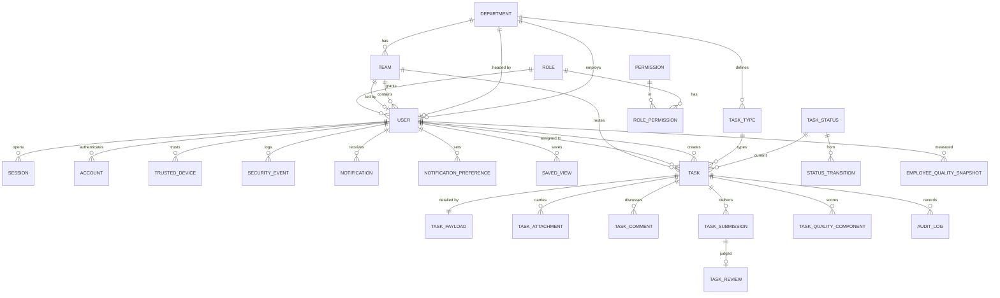

# 03 · Database

**MySQL**, accessed through Drizzle with `casing: "snake_case"` — TypeScript stays camelCase, SQL stays snake_case, and neither side has to compromise.

> **Session 3 moved the database from Neon Postgres to MySQL on Hostinger.** `docs/DECISIONS.md` ADR-019 records why and what it cost. The Postgres migration had never been applied to any database, so it was deleted and the baseline regenerated rather than translated — which is also why `user.role_id` simply _exists_ in the baseline instead of being migrated from `user.role`.

**Status: sessions 2 and 3's tables are designed and migrated; the rest are designed only.** Tables land one vertical slice at a time, and this file is updated in the session that creates them. Each table below carries the session that introduces it.

Twelve tables exist today, in one baseline migration `drizzle/0000_cute_eddie_brock.sql`:

| Session | Tables                                                                                                            | Schema file               |
| ------- | ----------------------------------------------------------------------------------------------------------------- | ------------------------- |
| 2       | `user`, `session`, `account`, `verification`, `two_factor`, `trusted_device`, `login_attempt`, `password_history` | `src/db/schema/auth.ts`   |
| 3       | `role`, `permission`, `role_permission`                                                                           | `src/db/schema/access.ts` |
| 3       | `audit_log` (written from session 3, read by the screen in session 18)                                            | `src/db/schema/system.ts` |

## Conventions

MySQL forces three of these, and `src/db/schema/columns.ts` is where each is decided once so twelve tables cannot drift apart.

- **Primary keys are `varchar(64)`**, generated by the application (`randomUUID()`), not `uuid` — MySQL has no such type, and Better Auth generates its own string ids for the five tables it owns anyway. `ID_LENGTH` is shared by every key and every foreign key, so a reference can never fail to match its target's type.
- **Every indexed column has a declared length.** `text` cannot be a key in MySQL, and a key column in `utf8mb4` caps at 768 characters. Hence `varchar(255)` for emails and tokens, `varchar(64)` for ids and provider names.
- **Timestamps are `datetime(3)` in UTC**, not `timestamp` — MySQL's `TIMESTAMP` expires in 2038. `DATETIME` carries no zone, so `src/db/index.ts` pins the mysql2 driver (`timezone: "Z"`) _and_ the session (`SET time_zone = '+00:00'`). Those two are one decision in two places; removing either shifts every expiry by the server's offset.
- **"Now" comes from the driver, not from a column default.** `now()` as a `DATETIME` default needs MySQL 8.0.13+ and behaves differently on MariaDB, so `tsNow()` supplies it. One clock, and the DDL stays portable across whatever the host runs.
- Every table has `created_at`. Mutable tables also have `updated_at`, refreshed by `$onUpdateFn`.
- Deletion is soft wherever history matters (`deleted_at`), because the audit log must keep pointing at something real.
- **Every foreign key is indexed**, and so is every column a list filters or sorts on. The index list per table below is not aspirational; it is part of the migration.
- Money and scores are `decimal`, never float. Scores are `decimal(5,2)` on a 0–100 scale.
- Enumerated values an admin can edit at runtime (statuses, task types, departments, roles) are **tables**. Values genuinely fixed in code (scope, device kind, priority) are `varchar` with a TypeScript-level union rather than a MySQL `ENUM`, so adding one is a data change and not an `ALTER TABLE` on a large table.

## ERD

## Tables

### Organisation

#### `department` — session 4

| Column       | Type                          | Notes                                                                          |
| ------------ | ----------------------------- | ------------------------------------------------------------------------------ |
| `id`         | uuid pk                       |                                                                                |
| `name`       | text not null                 | `البرمجة`                                                                      |
| `key`        | text not null unique          | `programming` — the machine identifier the admin sets                          |
| `kind`       | text not null                 | check in (`delivery`, `source`, `both`) — receives work, creates work, or both |
| `color`      | text not null                 | token name: `blue`, `violet`, `green`, `amber`                                 |
| `head_id`    | uuid → user.id null           |                                                                                |
| `is_active`  | boolean not null default true |                                                                                |
| `sort_order` | integer not null              |                                                                                |

Indexes: `key` (unique), `head_id`, `is_active`.

#### `task_type` — session 4

| Column          | Type                          | Notes                                                          |
| --------------- | ----------------------------- | -------------------------------------------------------------- |
| `id`            | uuid pk                       |                                                                |
| `department_id` | uuid → department.id not null |                                                                |
| `name`          | text not null                 | `سرعة الصفحات`                                                 |
| `key`           | text not null                 | `page_speed`                                                   |
| `is_active`     | boolean not null default true |                                                                |
| `field_config`  | jsonb null                    | reserved for the dynamic form builder — `OPEN_QUESTIONS.md` Q9 |

Indexes: `department_id`, unique on (`department_id`, `key`).

#### `team` — session 6

| Column          | Type                          | Notes            |
| --------------- | ----------------------------- | ---------------- |
| `id`            | uuid pk                       |                  |
| `department_id` | uuid → department.id not null |                  |
| `name`          | text not null                 | `فريق أحمد سعيد` |
| `leader_id`     | uuid → user.id null           |                  |

Indexes: `department_id`, `leader_id`.

Load percentage is **derived** (active tasks ÷ members × a per-department capacity), never stored — a stored figure would be wrong within the hour.

### Identity and access

#### `user` — sessions 2 and 3, extended session 5

Better Auth owns `id`, `name`, `email`, `email_verified`, `image`, `created_at`, `updated_at`. **Session 2 added** `two_factor_enabled` (boolean) and `password_changed_at` (datetime, which drives the 90-day expiry). **Session 3 added** `role_id` (`varchar(64)` → `role.id`, not null, `ON DELETE RESTRICT`), replacing session 2's text `role` column.

`RESTRICT` and not `CASCADE` or `SET NULL`, deliberately: deleting a role out from under its holders would either delete the people or leave them with no role at all. The database refuses, and `deleteRoleAction` refuses first with a readable message — the two must agree, which is why the action re-counts inside its transaction rather than trusting the list the admin was looking at.

Indexes today: `email` (unique), `role_id`.

Session 5 adds:

| Column                  | Type                             | Notes                                    |
| ----------------------- | -------------------------------- | ---------------------------------------- |
| `department_id`         | varchar(64) → department.id null |                                          |
| `team_id`               | varchar(64) → team.id null       |                                          |
| `job_title`             | varchar null                     | `مطوّرة أولى`                            |
| `initials`              | varchar null                     | avatar fallback, `م ف`                   |
| `can_change_own_status` | boolean not null default false   | the per-member switch a team leader sets |
| `is_active`             | boolean not null default true    |                                          |
| `deleted_at`            | datetime null                    |                                          |

Adding `department_id` and `team_id`: indexes on both, plus `is_active`. Until they exist, `SignedInUser.teamId` and `.departmentId` are null and every `team`/`dept` scope check denies — see `src/features/access/scope.ts`.

#### `session`, `account`, `verification`, `two_factor` — session 2

Better Auth's own tables. Their columns are dictated by the adapter, so `src/db/schema/auth.ts` transcribes rather than designs them; the indexes are ours.

- **`session`** — `token` unique, `user_id`, and (`user_id`, `expires_at`) for the session list on `/settings/security`.
- **`account`** — holds the scrypt password hash in `password` for `provider_id = 'credential'`. Indexes: `user_id`, and (`provider_id`, `account_id`) unique.
- **`verification`** — the single-use token store, and it carries more than its name suggests: the password-reset token, the half-authenticated 2FA challenge, the hashed code, the per-challenge attempt counter **and** the trusted-device grant, all keyed by `identifier`. Indexes: `identifier`, `expires_at`.
- **`two_factor`** — one row per user. The code is not here; this row exists so the plugin has somewhere to keep `failed_verification_count` and `locked_until`, which is what enforces "بعد 5 محاولات خاطئة … إيقاف مؤقت 15 دقيقة". Index: `user_id`.

#### `login_attempt` — session 2

| Column         | Type                           | Notes                           |
| -------------- | ------------------------------ | ------------------------------- |
| `id`           | text pk                        |                                 |
| `email`        | text not null                  | lower-cased; **no** foreign key |
| `ip_address`   | text null                      |                                 |
| `user_agent`   | text null                      |                                 |
| `succeeded`    | boolean not null default false |                                 |
| `attempted_at` | timestamptz not null           |                                 |

Index: (`email`, `attempted_at`) — the only access pattern, and the one the lockout check runs on every sign-in.

Keyed by email rather than by `user_id`, deliberately, and with no foreign key for the same reason: an attempt against an address with no account has to be counted too, or a lockout becomes the answer to "does this account exist?".

The rule lives in `src/features/auth/lockout.ts` as a pure function over this ledger, so it is unit-tested without a database. Only _consecutive_ failures count — a success clears the budget — and the lock is dated from the failure that tripped it, so continued guessing cannot extend someone else's lockout.

#### `password_history` — session 2

`id`, `user_id` → user.id cascade, `password_hash`, `created_at`. Indexes: `user_id`, (`user_id`, `created_at`).

Hashes only; the reset screen's "كيف تُخزَّن كلمة المرور" panel promises exactly this. Holds the last `passwordHistoryDepth` (5) per user and is pruned on every password change, because a hash is a credential and keeping one forever has no upside.

#### `role` — session 3

| Column        | Type                           | Notes                                                    |
| ------------- | ------------------------------ | -------------------------------------------------------- |
| `id`          | varchar(64) pk                 |                                                          |
| `name`        | varchar(128) not null          | `قائد الفريق` — user-entered, one language (Q21)         |
| `key`         | varchar(64) not null unique    | `lead` — immutable after creation                        |
| `scope`       | varchar(8) not null            | `own` \| `team` \| `dept` \| `all`, default `own`        |
| `scope_label` | varchar(128) null              | the wireframe's own per-role wording, null for new roles |
| `description` | varchar(512) null              | the sentence on the roles list; null for new roles (Q21) |
| `icon`        | varchar(32) not null           | glyph key, default `badge` (Q21)                         |
| `is_system`   | boolean not null default false | a system role cannot be deleted                          |
| `sort_order`  | int not null default 0         | list and matrix column order                             |

Indexes: `key` unique, `sort_order`.

`scope_label` exists because the wireframe writes a seeded role's reach in words the create modal does not offer — "قسمه بالكامل", "النظام بالكامل" against the modal's "قسمه" and "كل الأقسام". A role an administrator creates has none and renders the canonical label for its scope.

**`scope` is not a capability.** It decides which rows a role may act on, where a capability decides which actions exist at all; `docs/DECISIONS.md` ADR-021 explains why no capability string can express it.

#### `permission` — session 3

| Column       | Type                  | Notes                                   |
| ------------ | --------------------- | --------------------------------------- |
| `key`        | varchar(64) pk        | `tasks.assign`                          |
| `group_key`  | varchar(32) not null  | `tasks`, `team`, `management`, `system` |
| `label_ar`   | varchar(128) not null |                                         |
| `label_en`   | varchar(128) not null |                                         |
| `sort_order` | int not null          |                                         |

Index: (`group_key`, `sort_order`) — the matrix's read.

Seeded from `CAPABILITIES` in `src/lib/permissions.ts` — that constant is the source, this table is the copy the admin edits. The seed **replaces** the table rather than upserting it: a row no longer in `CAPABILITIES` is a capability the code has stopped enforcing, and leaving it would offer an admin a switch that controls nothing.

Both locales are columns rather than `messages/*.json` keys because a capability is data — adding one should be a seed row, not a code deploy. 30 rows today; the wireframe's matrix draws 22. See `OPEN_QUESTIONS.md` Q19.

#### `role_permission` — session 3

`role_id` (→ `role.id`, cascade) + `permission_key` (`varchar(64)`), composite primary key, both additionally indexed.

`permission_key` is deliberately **not** a foreign key onto `permission.key`: wildcard grants (`tasks.*`, `*`) are legal values here and are not rows there. They are stored literally rather than expanded, so "the manager can do everything under tasks" stays true when a fifteenth task capability is added. `grantsInclude()` resolves them at check time, and `applyCellChanges()` breaks a wildcard open when one of its members is revoked. ADR-020.

### Tasks

#### `task` — session 7

| Column                                                                  | Type                            | Notes                                         |
| ----------------------------------------------------------------------- | ------------------------------- | --------------------------------------------- |
| `id`                                                                    | uuid pk                         |                                               |
| `ref`                                                                   | text not null unique            | `PRG-1842` — per-department prefix + sequence |
| `title`                                                                 | text not null                   |                                               |
| `task_type_id`                                                          | uuid → task_type.id not null    |                                               |
| `department_id`                                                         | uuid → department.id not null   | the **receiving** department                  |
| `creator_id`                                                            | uuid → user.id not null         |                                               |
| `team_id`                                                               | uuid → team.id null             | null until routed                             |
| `lead_id`                                                               | uuid → user.id null             |                                               |
| `assignee_id`                                                           | uuid → user.id null             | null until assigned                           |
| `status_key`                                                            | text → task_status.key not null |                                               |
| `priority`                                                              | text not null                   | check in (`low`, `medium`, `high`, `urgent`)  |
| `effort`                                                                | text null                       | check in (`small`, `medium`, `large`)         |
| `due_date`                                                              | date null                       |                                               |
| `is_draft`                                                              | boolean not null default false  |                                               |
| `revision_count`                                                        | integer not null default 0      |                                               |
| `rejection_count`                                                       | integer not null default 0      |                                               |
| `quality_score`                                                         | numeric(5,2) null               | null until approved                           |
| `assigned_at`, `started_at`, `submitted_at`, `approved_at`, `closed_at` | timestamptz null                | the lifecycle clock                           |
| `created_at`, `updated_at`, `deleted_at`                                | timestamptz                     |                                               |

Indexes: `ref` (unique), `status_key`, `department_id`, `team_id`, `assignee_id`, `creator_id`, `lead_id`, `due_date`, `priority`, `quality_score`, `created_at`, and a composite `(department_id, status_key, due_date)` for the dashboard's default view. Every one of those columns is a filter or a sort on `/tasks` or the dashboard.

#### `task_payload` — session 7

One row per task, holding the department-specific brief. Programming and UI/UX ask for genuinely different things, so the shared columns are real columns and the rest is `jsonb`:

| Column       | Type              | Notes                             |
| ------------ | ----------------- | --------------------------------- |
| `task_id`    | uuid pk → task.id |                                   |
| `goal`       | text not null     | both departments                  |
| `scope`      | text not null     | both                              |
| `acceptance` | text not null     | both                              |
| `references` | text null         | both                              |
| `fields`     | jsonb not null    | the department-specific remainder |

`fields` for **Programming**: `urls`, `environment`, `device`, `repro`. For **UI/UX**: `deliverable`, `audience`, `direction`, `breakpoints`, `copy`, `constraints`.

The trade-off is deliberate: these fields are written once and read as a block, never filtered on, so columns would buy nothing and would have to change every time an admin adds a task type. Anything that becomes filterable gets promoted to a column in the session that makes it filterable.

#### `task_status` — session 4

| Column            | Type                           | Notes                                        |
| ----------------- | ------------------------------ | -------------------------------------------- |
| `key`             | text pk                        | `progress`                                   |
| `label_ar`        | text not null                  | `قيد التنفيذ`                                |
| `color_token`     | text not null                  | `--st-progress`                              |
| `sort_order`      | integer not null               | drives board column order and filter order   |
| `is_terminal`     | boolean not null default false |                                              |
| `counts_in_stats` | boolean not null default true  | `draft` is false                             |
| `sla_hours`       | integer null                   | `created` → 1 working day, `submitted` → 24h |

Seeded with the twelve tokens from the design spec. Note `أُعيد التقديم` (resubmitted) appears in the wireframe's flow diagram but has no colour token and no row on the settings screen — `OPEN_QUESTIONS.md` Q3 decides whether it is a status or only a transition.

#### `status_transition` — session 4

| Column                | Type                   | Notes |
| --------------------- | ---------------------- | ----- |
| `from_key`            | text → task_status.key |       |
| `to_key`              | text → task_status.key |       |
| `required_permission` | text → permission.key  |       |

Composite pk (`from_key`, `to_key`). This table **is** the state machine: a transition that has no row here cannot happen, and the server rejects it regardless of what the client sent.

#### `task_attachment` — session 9

| Column                     | Type                    | Notes                            |
| -------------------------- | ----------------------- | -------------------------------- |
| `id`                       | uuid pk                 |                                  |
| `task_id`                  | uuid → task.id not null |                                  |
| `kind`                     | text not null           | check in (`request`, `delivery`) |
| `filename`, `content_type` | text not null           |                                  |
| `size_bytes`               | integer not null        |                                  |
| `blob_url`                 | text not null           | Vercel Blob                      |
| `uploaded_by`              | uuid → user.id not null |                                  |

Indexes: `task_id`, (`task_id`, `kind`).

#### `task_comment` — session 9

`id`, `task_id`, `author_id`, `body`, `created_at`, `deleted_at`. Indexes: `task_id`, `author_id`.

#### `task_submission` — session 10

| Column         | Type                    | Notes                                   |
| -------------- | ----------------------- | --------------------------------------- |
| `id`           | uuid pk                 |                                         |
| `task_id`      | uuid → task.id not null |                                         |
| `round`        | integer not null        | 1 for the first submission, then 2, 3 … |
| `description`  | text not null           |                                         |
| `submitted_by` | uuid → user.id not null |                                         |
| `submitted_at` | timestamptz not null    |                                         |

Indexes: `task_id`, unique (`task_id`, `round`).

#### `task_review` — session 11

| Column                 | Type                                      | Notes                             |
| ---------------------- | ----------------------------------------- | --------------------------------- |
| `id`                   | uuid pk                                   |                                   |
| `submission_id`        | uuid → task_submission.id not null unique | one verdict per submission        |
| `reviewer_id`          | uuid → user.id not null                   |                                   |
| `decision`             | text not null                             | check in (`approved`, `rejected`) |
| `score`                | smallint null                             | 1–5, required when approved       |
| `notes`                | text null                                 |                                   |
| `rejection_reason_key` | text null                                 | → `rejection_reason.key`          |
| `required_changes`     | text null                                 | required when rejected            |
| `resubmit_due`         | date null                                 |                                   |

Indexes: `submission_id` (unique), `reviewer_id`, `decision`, `rejection_reason_key`.

#### `rejection_reason` — session 11

`key` pk, `label_ar`, `sort_order`, `is_active`. Six seed rows from the wireframe's two rejection dialogs. Whether admins may edit these is `OPEN_QUESTIONS.md` Q11; the table shape supports either answer.

### Quality

#### `task_quality_component` — session 13

| Column          | Type                  | Notes                                                                  |
| --------------- | --------------------- | ---------------------------------------------------------------------- |
| `task_id`       | uuid → task.id        |                                                                        |
| `component_key` | text                  | `brief`, `adherence`, `first_pass`, `on_time`, `revisions`, `reviewer` |
| `weight`        | numeric(5,2) not null | the weight **as it was when scored**                                   |
| `achieved`      | numeric(5,2) not null |                                                                        |

Composite pk (`task_id`, `component_key`). Storing the weight per row rather than reading today's setting is what makes the score auditable: settings changes apply to new tasks only, and a task scored last month must still explain itself with last month's weights.

#### `employee_quality_snapshot` — session 13

| Column                       | Type                    | Notes                                         |
| ---------------------------- | ----------------------- | --------------------------------------------- |
| `id`                         | uuid pk                 |                                               |
| `user_id`                    | uuid → user.id not null |                                               |
| `period_start`, `period_end` | date not null           | the rolling window                            |
| `score`                      | numeric(5,2) not null   |                                               |
| `components`                 | jsonb not null          | five rows of `{key, weight, value, achieved}` |
| `computed_at`                | timestamptz not null    |                                               |

Indexes: `user_id`, (`user_id`, `period_end`).

### System

#### `audit_log` — created session 3, read by the screen in session 18

| Column                     | Type                       | Notes                                         |
| -------------------------- | -------------------------- | --------------------------------------------- |
| `id`                       | varchar(64) pk             |                                               |
| `actor_id`                 | varchar(64) → user.id null | `ON DELETE SET NULL`; null for system actions |
| `action`                   | varchar(64) not null       | `permission.granted`, `role.created`, …       |
| `entity_type`, `entity_id` | varchar(32) / varchar(128) | not null                                      |
| `field`                    | varchar(64) null           | the capability key, for a matrix cell         |
| `value_from`, `value_to`   | json null                  | what the UI renders as a `from → to` diff     |
| `ip`, `user_agent`         | varchar(64) / text, null   | evidence, never used to decide anything       |
| `created_at`               | datetime(3) not null       |                                               |

Indexes: (`entity_type`, `entity_id`), `actor_id`, `created_at`, `action`.

Append-only. `src/features/access/audit.ts` is the only writer and exposes an insert and nothing else — no update, no delete, in the application at all, which is how the activity screen's promise to the user is kept in code rather than in prose.

Rows are written **inside** the same transaction as the change they describe. A permission grant that committed while its audit row failed would leave a system where someone gained access and nobody can say who granted it.

Actions written so far: `permission.granted`, `permission.revoked`, `permission.restored`, `role.created`, `role.updated`, `role.deleted`.

#### `notification` — session 19

`id`, `user_id`, `event_key`, `title`, `meta`, `task_id` (null), `read_at` (null), `created_at`. Indexes: `user_id`, (`user_id`, `read_at`), `task_id`.

#### `notification_preference` — session 19

`user_id` + `event_key` composite pk, plus `in_app`, `email`, `digest` booleans. 18 event keys across four groups (my tasks, tasks I created, team management, security). Digest time, digest days and quiet hours live on `user_notification_settings` (one row per user).

#### `trusted_device` — session 2

`id`, `user_id` → user.id cascade, `trust_identifier` (unique), `label`, `os`, `browser`, `kind`, `ip_address`, `last_seen_at`, `expires_at`, `created_at`. Indexes: `trust_identifier` unique, `user_id`, (`user_id`, `last_seen_at`), (`user_id`, `expires_at`).

**This table does not decide whether a device is trusted.** Better Auth does, from a signed cookie plus a `verification` row under `trust-device-<random>`; this table is keyed by that same identifier and carries only the description the wireframe's list needs — "Windows 11 · Chrome", the IP, the last use. Duplicating the authority would mean two sources that can disagree about who is allowed in, which is the one thing an auth system cannot afford. Revoking therefore deletes both rows (`revokeTrustedDevice` in `src/features/auth/trusted-devices.ts`).

#### `security_event` — session 20

`id`, `user_id`, `type` (`login`, `login_failed`, `password_changed`, `device_trusted`, `device_revoked`, `permission_changed`), `ip`, `user_agent`, `created_at`. Indexes: `user_id`, `created_at`.

#### `app_setting` — session 4

`key` pk, `value` jsonb, `updated_by`, `updated_at`. One row per settings group: `quality_weights`, `task_rules`, `security_policy`, `two_factor`, `list_defaults`. A typed accessor per group lives beside it so no caller reads raw JSON.

#### `saved_view` — session 8

`id`, `user_id`, `name`, `filters` jsonb, `columns` jsonb, `created_at`. Indexes: `user_id`.

## Migrations

`pnpm db:generate` writes SQL into `drizzle/`, `pnpm db:migrate` applies it. Migrations are committed, reviewed and never edited after they have run anywhere. Neon creates a database branch per Vercel preview, so a migration is exercised on real data shape before it reaches production.
